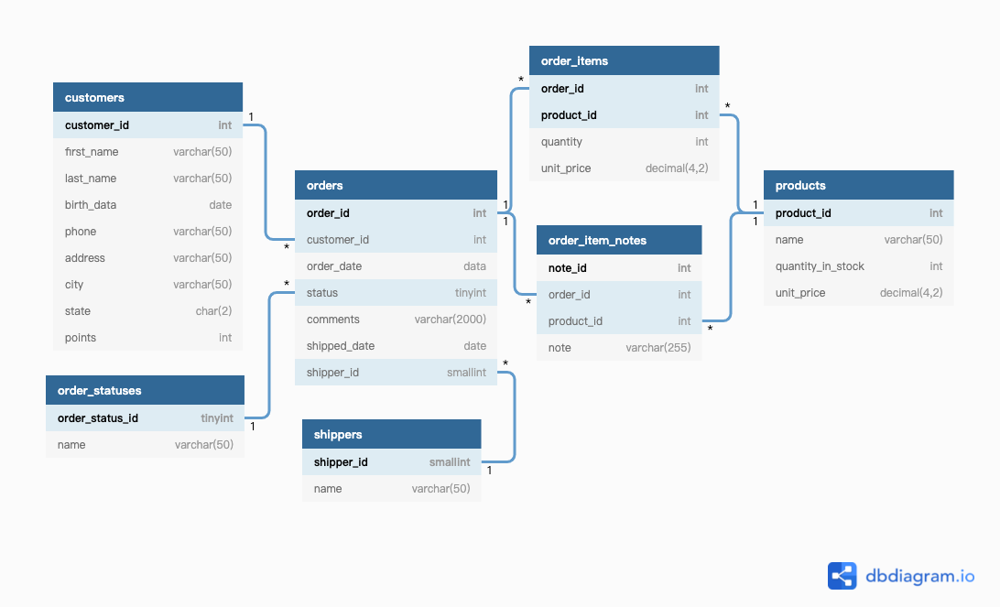
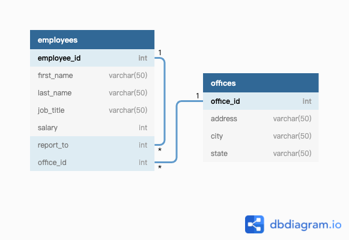
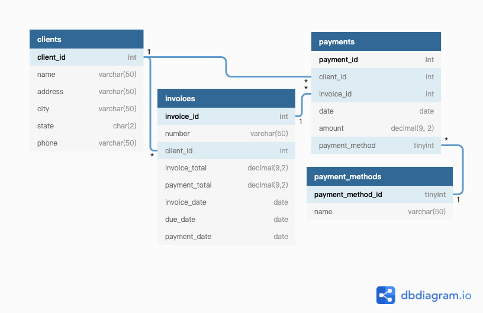

# AYNTKA-MySQL

**A**ll **y**ou **n**eed **t**o **k**now **a**bout **MySQL**

## 参考资料

- [CodeWithMosh MySQL Course](https://www.bilibili.com/video/BV1UE41147KC)
- [MySQL Tutorial](https://www.mysqltutorial.org)
- [MySQL必知必会](https://m.douban.com/book/subject/3354490/)
- [数据库设计工具: DBDiagram](https://dbdiagram.io/)
- [数据库数据标记语言：DBML](https://www.dbml.org/)
- [mycli: 强大的MySQL命令行工具](https://github.com/dbcli/mycli)

## 基本概念的介绍

### 数据库 Database

> A **Database** is a collection of data stored in a format that can easily be accessed

为了更方便的管理我们的数据，我们一般会使用一种叫数据库管理系统（Database Management System，简称DBMS）的系统级软件，它提供了用户连接的接口，方便我们可以在连接数据库后进行插入、查询、修改和删除数据。

现在主流的数据库分为2类，一类是关系型（Relational）数据库，一类是非关系型（NoSQL）数据库。

在关系型数据库中我们把数据存储在利用关系互相连接的表中，每张表中都会存储一种特定类型的对象数据。SQL或者SQUEL就是我们用来处理这些关系型DBMS的语言。 目前主流的关系型数据库有MySQL、微软的SQL Server，还有Oracle，Postgres等。每种关系型数据库提供的SQL可能略有不同，但基本都遵守SQL语言规范。

在非关系型数据库中，没有表或者关系，它们一般都无法使用SQL语言来进行数据库操作，往往有自己的数据库查询语言。

### SQL还是SEQUEL

最早的SQL的全称为Structured English QUEry Language，但因为SEQUEL是一个飞机商标，就被简化为SQL。

推荐发音，在我们指关系数据库查询语言时，读`sequel`，在`MySQL`中读`s--q--l`

### 数据库中的逻辑存储结构

一般的数据库都提供了数据库、数据表、行、列等这样的逻辑结构，方便我们进行数据库的操作，这些逻辑结构并不代表着数据的真实存储形式。

* 数据库（database）：一些相关的表组成的集合

* 数据表（table）：表是数据的矩阵，在一个数据库中表看起来就像一个简单的电子表格

* 列（column）：列代表了数据表的某一种属性或字段，一列（数据元素）包含了相同的数据类型

* 行（row）：一行是一组相关的数据，我们称之为记录（Record），一行一行的数据组成一数据表。

* 表头（header）：表头是由列名组成

* 键（key）：一般我们从数据表中获取某一行数据时，都需要通过一个键值来定位到某一行。

## 本教程中使用的数据库说明

本教程中一共涉及到4个数据库（database）

### sql_store数据库

sql_store是一个类似于在线电商的后台数据库，一共有7张表，其中orders是整个数据库的核心表，记录的是一次购物订单，每个购物订单订单对应一个消费者，对应多个商品，对应一个货运。可以想象为我们在京东或淘宝上的一个订单，里面包括了多个商品，最终这个订单是有一个物流来承运。



**customers表**


| 字段名      | 数据类型                                   | 意义     |
| ----------- | ------------------------------------------ | -------- |
| customer_id | int, not null, Primary Key, auto_increment | 客户id   |
| first_name  | varchar(50), not null                      | 名字     |
| last_name   | varchar(50), not null                      | 姓       |
| birth_date  | date                                       | 生日日期 |
| phone       | varchar(50)                                | 手机号   |
| address     | varchar(50), not null                      | 地址     |
| city        | varchar(50), not null                      | 城市     |
| state       | char(2), not null                          | 州       |
| points      | int, not null,default 0                    | 积分     |

**orders表**

| 字段名       | 数据类型                                   | 意义     |
| ------------ | ------------------------------------------ | -------- |
| order_id     | int, not null, Primary Key, auto_increment | 订单号   |
| customer_id  | int, not null                              | 客户id   |
| order_date   | date, not null                             | 订单日期 |
| status       | tinyint,not null, default 1                | 订单状态 |
| comments     | varchar(2000)                              | 订单备注 |
| shipped_date | date                                       | 发货日期 |
| shippper_id  | smallint                                   | 运货商id |

**order_items表**

| 字段名     | 数据类型                                   | 意义   |
| ---------- | ------------------------------------------ | ------ |
| order_id   | int, not null, Primary Key, auto_increment | 订单id |
| product_id | int, not null, Primary Key                 | 商品id |
| quantity   | int, not null                              | 数量   |
| unit_price | decimal(4,2), not null                     | 单价   |

**order_statuses表**

order_statuses表提供了每种订单状态编号的含义，包括：processed 已处理、shipped 已寄出、delivered 已送达，它一个枚举表。

| 字段名          | 数据类型                       | 意义           |
| --------------- | ------------------------------ | -------------- |
| order_status_id | tinyint, not null, Primary Key | 订单状态id     |
| name            | varchar(50), not null          | 订单状态枚举值 |

**order_item_notes表**

| 字段名     | 数据类型                   | 意义 |
| ---------- | -------------------------- | ---- |
| note_id    | int, not null, Primary Key |      |
| order_id   | int, not null              |      |
| product_id | int, not null              |      |
| note       | varchar(255), not null     |      |

**products表**

| 字段名            | 数据类型                                   | 意义     |
| ----------------- | ------------------------------------------ | -------- |
| product_id        | int, not null, Primary Key, auto increment | 商品id   |
| name              | varchar(50), not null                      | 商品名称 |
| quantity_in_stock | int, not null                              | 库存数量 |
| unit_price        | decimal(4, 2), not null                    | 商品单价 |

**shippers表**

| 字段名     | 数据类型                                        | 意义         |
| ---------- | ----------------------------------------------- | ------------ |
| shipper_id | smallint, not null, primary key, auto increment | 快递公司id   |
| name       | varchar(50), not null                           | 快递公司名字 |

### sql_inventory数据库

sql_inventory是一个库存数据库，它比较简单，里面只有一张商品库存的表，和sql_store中的商品表是一样的。在整个教程中使用的非常少。

### sql_hr数据库

sql_hr表示是公司人员管理的数据库，包括了2张表，一张是员工表，一张是办公室的信息表。



**employees表**

其中report_to字段表示汇报对象，它指向的是本表中的一项，是一个自联结关系。

| 字段名      | 数据类型                    | 意义     |
| ----------- | --------------------------- | -------- |
| employee_id | int, not null, Primary Key, | 员工id   |
| first_name  | varchar(50), not null       | 名字     |
| last_name   | varchar(50), not null       | 姓       |
| job_title   | varchar(50), not null       | 职务     |
| salary      | int, not null               | 工资     |
| report_to   | int                         | 汇报对象 |
| offfice_id  | int, not null               | 办公室id |

**offices表**

|           | 数据类型                                   | 意义     |
| --------- | ------------------------------------------ | -------- |
| office_id | int, not null, Primary Key, auto_increment | 办公室id |
| address   | varchar(50), not null                      | 地址     |
| city      | varchar(50), not null                      | 城市     |
| state     | varchar(50), not null                      | 州       |

### sql_invoicing数据库

sql_invoicing是财务数据库，第个客户可能对应多个交易，每个交易对应一张发票，每张发票可能会产生多笔支付。



**clients表**

| 字段名     | 数据类型                   | 意义     |
| ---------- | -------------------------- | -------- |
| client_id  | int, not null, Primary Key | 客户id   |
| name       | varchar(50), not null      | 名字     |
| address    | varchar(50), not null      | 地址     |
| city       | varchar(50), not null      | 城市     |
| state      | char(2), not null          | 州       |
| phone      | varchar(50)                | 手机号   |

**invoices表**

| 字段名        | 数据类型                           | 意义       |
| ------------- | ---------------------------------- | ---------- |
| invoice_id    | int, not null, Primary Key         | 发票id     |
| number        | varchar(50), not null              | 发票号     |
| client_id     | int, not null                      | 客户id     |
| invoice_total | decimal(9, 2), not null            | 发票总额   |
| payment_total | decimal(9, 2), not null, default 0 | 已支付总额 |
| invoice_date  | date, not null                     | 发票日期   |
| due_date      | date, not null                     | 截止日期   |
| payment_date  | date                               | 付款时间   |

**payments表**

| 字段名         | 数据类型                   | 意义     |
| -------------- | -------------------------- | -------- |
| payment_id     | int, not null, Primary Key | 付款id   |
| client_id      | int, not null              | 客户id   |
| invoice_id     | int, not null              | 发票id   |
| date           | date, not null             | 付款日期 |
| amount         | decimal(9,2), not null     | 付款金额 |
| payment_method | tinyint, not null          | 支持方法 |

**payment_methods表**

| 字段名            | 数据类型                                       | 意义           |
| ----------------- | ---------------------------------------------- | -------------- |
| payment_method_id | tinyint, not null, primary key, auto increment | 支持方法id     |
| name              | varchar(50), not null                          | 支付方法枚举值 |

## 单数据表的数据的查询

### 简单的查询示例

```sql
-- 查询整个表中的数据
select * from customers;

-- 查询符合条件的记录
select * from customers where customer_id=1;

-- 对查询结果进行排序
select * from customers order by points;

-- 查询指定列的数据
select customer_id, first_name, points from customers;
```

### 使用`select`子句对查询的数据进行加工

```sql
-- 多增加了new price这一列，是通过unit_price来计算加工出来的
select name, unit_price, unit_price * 1.1 as 'new price' from products;

-- 对customers表中的state这一列进行去重后展示
select distinct state from customers;
```

### 使用`where`子句设置复杂查询条件

```sql
-- 在date类型上可以直接使用比较运算符（>、<、=、!=、<>）
select * from customers where birth_date > '1990-01-01';

-- 多条件组合查询，可以使用 AND、OR、NOT来进行逻辑组合
select * from customers where not (birth_date > '1990-01-01' or points > 1000);

-- 在where子句里使用列与列的运算
select * from order_items where order_id=6 and quantity * unit_price > 30;

-- 使用in来匹配列表
select * from products where quantity_in_stock in (49, 38, 72);

-- 使用between来匹配范围
select * from customers where birth_date between '1990-01-01' and '2000-01-01';

-- 使用LIKE进行字符串模糊匹配
-- % 代表任意个任意字符
-- _ 代表任意一个字符
-- 查询手机号以9结尾的行
select * from customers where phone like '%9';
-- 查找first name中以b开头，y结尾，并且中间包括4个任意字符的行
select * from customers where first_name like 'b____y';

-- LIKE的完美替代：REGEXP
-- ^匹配单词开头
-- $匹配单词结尾
-- a|b 匹配多个模式
-- [a-h]匹配一个范围列表
select * from customers where last_name regexp '^B[RU]';

-- 查找空值
-- 查找所有还未发货的订单，即shipped_data是空
select * from orders where shipped_date is null;
```

### 使用`order by`子句对查询结果进行排序

可以按表中某一列的值进行排序，也可以是由已有的列进行加工计算出来的值，默认是升序排列，如果要降序排序，需要加上`DESC`。

```sql
查询order_id=2的所有订单，并按订单总价格进行降序排列
select * from order_items where order_id=2 order by quantity*unit_price DESC;
```

### 使用`limit`子句来限定查询结果的条数

```sql
-- 查询用户积分最高的3位用户
select * from customers order by points desc limit 3;
-- 设置查询的偏移值，从offset=6（offset从0编号）的地方开始查询，只列出3项
select * from customers limit 6, 3;
```

## 多数据表的联合查询

可以使用`join`进行多表查询，当使用`join`时必须用`on`指定两边表对齐到的列。

```sql
-- 查询orders表，并且从customers表中获取用消费者的名字
select order_id, c.customer_id, first_name, last_name
from orders
join customers as c
on orders.customer_id = c.customer_id;

-- 跨库联合查询，需要在其他库的表名前加上库名
select * 
from order_items as oi 
join sql_inventory.products as p 
on oi.product_id = p.product_id;

-- 自连接，员工表中汇报对象本身也是公司员工之一
select
    e.employee_id,
    e.first_name,
    m.first_name as manager
from employees as e
join employees as m on e.reports_to = m.employee_id;

-- 多表联合查询
select p.payment_id, c.name, p.date, p.amount, pm.name
from payments as p
join clients as c on p.client_id=c.client_id
join payment_methods as pm on p.payment_method=pm.payment_method_id;

-- 当在连接某些组合主键的表时，需要使用多个条件的连接语句
select *
from order_items oi
join order_item_notes oin
on oi.order_id = oin.order_id and oi.product_id = oin.product_id;

-- 使用left join或right join进行外连接
-- 一般来说使用left join就可以了，不建议使用right join
-- left join的意思就是保留左表中的数据，并在右边中筛选符合条件的数据
-- 如果左表中的一些行，没有在右表中找到符合条件的，则对应的列就是空
select order_date, order_id, c.first_name, s.name,  os.name
from orders as o
join customers as c on o.customer_id = c.customer_id
left join shippers as s on o.shipper_id = s.shipper_id
join order_statuses as os on o.status = os.order_status_id;

-- 使用`using`来简化join条件
select *
from order_items oi
join order_item_notes oin
using (order_id, product_id);

-- 自然连接`nartural join`
-- 让引擎自动去判断连接条件，这个例子中是使用customer_id
select * from customers natural join orders;

-- 交叉连接 cross join
-- 让两张表组合，比如一张表存放的是尺寸，一张表存放的是颜色
-- 那么就可以对这两张表进行cross join生成所有尺寸颜色组合
select * from size cross join color;
select * from size, color;
```

使用`union`可以让我们沿着行的方向进行结果合并。

```sql
-- 先筛选小于2000分的青铜
-- 再合并2000-3000分之间的白银
-- 最后合入3000分以上的黄金
select customer_id, first_name, points, 'Bronze' as type
from customers
where points < 2000
union
select customer_id, first_name, points, 'Silver' as type from customers
where points between 2000 and 3000
union
select customer_id, first_name, points, 'Gold' as type from customers
where points >=3000
order by first_name;
```

## 数据的插入

当我们全量字段插入时，对于主键，往往是自增的，指定default是最好的，对于可以为空的字段，我们可以设置有效的值，也可以设置为`null`，对于其他有默认值的字段，可以使用`default`设置字段为默认值。

```sql
insert into customers
values(default, 'John', 'Smith', '1990-01-01', null, 'address', 'city', 'CA', default);
```

指定特定的列，在这种情况下，我们可以自定义字段的顺序，比如下面的例子中，我们把`birth_date`调整到了第一位。

```sql
insert into customers (birth_date， first_name, last_name, address, city, state)
values('1990-01-01', 'John', 'Smith', 'address', 'city', 'CA');
```

一次插入多条数据，多条数据之间用逗号隔开。

```sql
insert into products(name, quantity_in_stock, unit_price)
values ('product 1', 12, 1.67), ('product 2', 3, 2.34), ('product 3', 7, 0.88);
```

利用`last_insert_id`来获取上次插入的数据的`id`

```sql
insert into orders(customer_id, order_date, status)
values (1, '2019-03-05', 1);

insert into order_items
values (last_insert_id(), 1, 1, 2.95), (last_insert_id(), 2, 1, 3.95);
```

使用`select`子句来进行数据插入

```sql
```


## 数据的更新

```sql
-- 使用有效值
update invoices
set payment_total = 86.32, payment_date = '2019-12-8'
where invoice_id = 3;

-- 使用默认值和空值
update invoices
set payment_total = default, payment_date = null
where invoice_id = 3;

-- 使用其他列的值
update invoices
set payment_total = invoice_total * 0.5, payment_date = due_date
where invoice_id = 3;
```

一次更新多行

```sql
-- 给1990年之前的用户的积分加50分
update customers
set points = points + 50
where birth_date < '1990-01-01';
```

使用子句编写复杂的数据查询

```sql
update invoices
set payment_total = invoice_total * 0.5, payment_date = due_date
where client_id in (select client_id from clients where state in('CA', 'NY'));
```

## 数据的删除

```sql
delete from invoices
where client_id = (select client_id from clients where name = 'Nyworks')
```

## 数据统计与聚合

MySQL中支持的常用的统计函数有：

Function|功能描述
---|----
MAX()|返回最大值
MIN()|返回最小值
AVG()|返回平均数
SUM()|返回求和
COUNT()|返回总数目，不包括null值

```sql
select
    max(invoice_total) as highest,
    min(invoice_total) as lowest,
    avg(invoice_total) as average,
    sum(invoice_total * 1.1) as total,
    count(*) as total_records,
    count(distinct client_id) as client_number
from invoices
where invoice_date > '2019-07-01';
```

分组统计

```sql
select client_id, sum(invoice_total) as total
from invoices
where payment_date > '2019-01-01'
group by client_id
order by total DESC;
```

使用`having`进行分组后的筛选

```sql
select client_id, sum(invoice_total) as total
from invoices
where payment_date > '2019-01-01'
group by client_id
having total > 100;
```

分组汇总

使用`with rollup`可以对每个分组的结果进行再次汇总统计。

```sql
-- 按付款方式进行付款总额的统计
select pm.name as payment_method, sum(amount) as total
from payments
join payment_methods as pm on payment_method = pm.payment_method_id
group by pm.name with rollup;
```

```text
+----------------+--------+
| payment_method | total  |
+----------------+--------+
| Cash           | 10.00  |
| Credit Card    | 351.38 |
| <null>         | 361.38 |
+----------------+--------+
```

## 编写复杂的查询语句


我们可以在`where`语句的筛选条件中嵌入`select子句`，让筛选条件更加的灵活。

```sql
-- 查询员工表中所有薪水大于平均值的员工
-- 这里平均薪水就是使用了select子句
select * from employees 
where salary > (
    select avg(salary) from employees
);

-- 查询没有发票记录的客户信息
select * from clients
where client_id not in (
    select distinct client_id from invoices
);
```

我们可以使用`ALL、ANY`等关键字来完成单个值与集合的比较：

```sql
-- 查询所有发标金额大于客户3所有相关发票金额的发票
select * from invoice 
where invoice_total > all (
    select invoice_total from invoice where client_id = 3
);

-- 查询所有发票数量大于2张的客户
select * from clients
where client_id = any (
    select client_id from invoices group by client_id having count(*) > 2
);
```
这里使用`= any`实际上和`in`达到的效果是一样的。

使用`EXIST`

```sql
-- 查询所有没有被下过订单的商品

-- 第一种实现，它的缺点是后面的集合可能会特别大，影响性能
select * from products where product_id not in (
    select distinct product_id from order_items
);

-- 使用exists
select * from product as p where product_id not exists (
    select product_id from order_items where product_id = p.product_id
);
```

将查询的结果作为一个新表进行`join`

```sql
-- 查询所有工资高于同办公室平均工资的员工
select * from employees 
join (
    select office_id, avg(salary) as average_salary from employees
    group by office_id
) as office_average using (office_id)
where salary > average_salary;
```

## MySQL中的内置函数

内置函数主要用于处理数字、日期和文本。

### 常用的数值函数

函数|功能描述
---|---
ROUND(f,n=0)|对小数f进行四舍五入，保留n位小数
TRUNCATE(f,n=0)|对小数进行截断，保留n位小数
CEILING(f)|对小数f进行向上取整
FLOOR(f)| 对小数f进行向下取整
ABS(f)|对f取绝对值
RAND()|产生一个（0, 1)的随机小数


### 常用的字符串函数

函数|功能描述
---|---
LENGTH(str)|返回字符串str中字符的个数
UPPER(str|将字符串全部字符转换为大写
LOWER(str)|将字符串转换为小写
LTRIM(str)|去除字符串左边的空格
RTRIM(str)|去除字符串右边的空格
TRIM(str)|去除字符串两边的空格
LEFT(str,n)| 返回字符串最左边的n个字符
RIGHT(str,n)| 返回字符串最后n个字符
SUBSTRING(str, pos, n)| 返回字符串从pos位置（从1开始索引）开始的n个字符的子串
LOCATE(substr, str)|返回substr在str中第一次出现在位置，不区分大小写，搜索不到，则返回0
REPLACE(str, a, b)|将str中出现的字符串a替换为b
CONCAT(a, b)|将a和b两个字符串拼在一起

### 时间函数

函数|功能描述
---|---
NOW()|返回当前的时间点
CURDATE()|返回当前的日期
CURTIME()|返回当前的时间，不包括日期
YEAR(dt)|返回年
MONTH(dt)|返回月
MONTHNAME(dt)|返回月份字符串
DAY(dt)|返回日
DAYNAME(dt)|返回星期几
SECOND(dt)|秒
DATA_FORMAT(date, fomratstr)|可以将一个日期转为化一个自定义的格式
TIME_FORMAT(time, fomratstr)|可以将一个时间转为化一个自定义的格式
DATE_ADD(dt, INTERVAL n YEAR/...)|基于一个日期的加减
DATEDIFF(dt1, dt2)|计算两个日期之间的间隔
TIME_TO_SEC(time)|将时间转化为秒，以零点为起点


### IF语句

```sql
--- 如果条件为真，则返回value1，否则返回value2
if (condiction, value1, value2)
```

示例：对订单表进行筛选，如果是当前的订单，则显示活跃，否则显示已经归档

```sql
select order_id, 
       order_data, 
       if (YEAR(order_date) = YEAR(now()), 'Activae', 'Archived') as category
from orders;
```

### CASE语句

`case`语句可以处理多个分支的情况 

```sql
select order_id, 
       order_data, 
       case 
            when YEAR(order_date) = YEAR(now()) then 'Activate'
            when YEAR(order_date) < YEAR(now()) then 'Archived'
            else 'Future'
       end as category
from orders;
```


## 数据库视图

我们可以将某一个查询的结果保存为一个视图，方便我们后续的复用。

创建视图使用的是`create view <view name> as ...`这样的语法。

```sql
create view clients_balance as 
select c.client_id, name, sum(invoice_total)-sum(payment_total) as balance
from clients c
join invoices i using (client_id)
group by client_id, name;
```

对应着我们可以使用`drop view <view name>`来删除视图。

我们可以使用`create or replace <view name> as`来创建或更新一个原有的视图。

## 存储过程和函数

存储过程类似sql中的定义函数，它将一系列的sql语句包装在一起，重新起个名字，后续我们就可以直接使用这个名字来代替一系列复杂的sql语句。

```sql
```

## 触发器和事件

## 数据库事务与并发

## MySQL支持的数据类型

MySQL中一共支持大约5类的数据类型，包括了：String、Numeric、Date and Time、Blob、Spatial。

### String类型

* CHAR(x)：为固定长度的字符串，无论实际存储的字符串长度为多少，它都会占用x个字符的存储空间，最大的长度为255。

* VARCHAR(x)：变长存储的字符串，它会根据字符串的实际长度而动态的分配存储空间，但最大不超过x个字符空间。VARCHAR最大支持的长度为65535。
* TINYTEXT：最大可以存储255个字符
* TEXT：最大可以存储65535个字符，对于这个范围内的选择，我们最好是使用VARCHAR。
* MEDIUMTEXT：最长可以存储16MB的字符串
* LONGTEXT：最大可以存储4GB的字符串，可以用于存储一些日志等信息

需要注意的是上面字符串类型的存储能力都是按字符个数来定的，如果是存储非anscii码，那实际占用的存储空间，会更大一些。 

### 整数类型

* TINYINT（MySQL扩展类型）：占用1B空间，范围是：[-128, 127]
* SMALLINT：占用2B空间，范围是：[-32K, 32K]
* MEDIUMINIT（MySQL扩展类型）：占用BB空间，范围是：[-8M, 8M]
* INT/INTERGER：占用4B空间，范围是：[-2B, 2B]
* BIGINT（MySQL扩展类型）：占用8B空间，范围是：[-9Z, 9Z]

我们在使用整数类型时，也可以在后续加（x），它表示的是补0，如果数值位数不足x时，前面会补0。我们还可以在上述类型前面加上UNSIGNED用于表示无符号数，无符号数的范围是是从0开始的。

### 小数类型

* DECIMAL(p, s)：p表示小数的精度，也就是小数的位数，s表示小数点后的位置，它用于表示高精度的数字，比如在银行系统中。
* DEC、NUMERIC、FIXED 和DECIMAL是一个意思。
* FLOAT：4B浮点数，可以表示更大的数，但精度有限
* DOUBLE/REAL ：8B浮点数，比FLOAT可以表示的数的范围更大，精度也更高。

### 布尔类型

* BOOL/BOOLEAN：只会占用1个字节，它的字面值为TRUE和FALSE。

 ### 枚举类型

* ENUM(VALUE1, VALUE2, VALUE3)：枚举值整体构成了类型的定义。

实际中我们往往比较少的使用枚举类型，在需要用于枚举值的地方，我们往往会把枚举值列在一个单独的查询表（Lookup Table）中。

### 集合类型

* SET(VALUE1, VALUE2, VALUE2)：包含了有限个元素的集合，对应类型的字段可以是这个集合中若干个值构成的子集合。

ENUM和SET就类似于我们在Excel表格中的下拉选择框，枚举类型只允许选择一种，而集合类型则可以选择多种。

### DATE/TIME类型

* DATE：以YYYY-MM-DD格式的日期，在1000-01-01和9999-12-31之间。
* TIME：存储时间为HH::MM::SS格式
* DATETIME：占用8B，可以存储更大范围的时间点
* TIMESTAMP：占用4B，只能存储2038年之前的时间戳
* YEAR：以2位或4位数字格式来存储的年份，如果长度指定为2，即YEAR(2)，则年份就可以为1970至2069，如果长度指定为4，则年份范围为1901-2155，默认长度为4。

### Blob类型

我们可以用blob在数据库中存储图像、视频、PDF、word文件等，几乎所有的二进制数据。

* TINYBLOB: 255B
* BLOB: 65K
* MEDIUMBLOB: 16M
* LONGBLOB: 4GB 

不建议使用MySQL来存储大量的blob类型的数据，它会大大增加MySQL数据库的体积，导致我们不能很友好的对数据库进行备份，同时也会很影响性能，我们从数据库中读取blob数据，几乎一定比直接在文件系统中读取的慢。

### JSON类型

比如我们为我们`sql_store`数据库中的`products`表增加一列为`properties`用于表示商品的一些其他属性项，比如对于电视产品来说，我们可以如下更新它的properties字段。

```mysql
-- 直接使用json字符串来更新数据表中的json类型的行
update products
set properties = '
{
    "dimensions": [1, 2, 3],
    "weight": 10,
    "manufacturer": {"name": "sony"}
}
'
where product_id = 1;
```

除了用json字符串外，我们还可以用mysql提供的json函数（`JSON_OBJECT`、`JSON_ARRAY`）来构造json对象。

```mysql
update products
set properties = JSON_OBJECT(
  'weight', 10, 
  'dimensions', JSON_ARRAY(1,2,3),
  'manufacturer', JSON_OBJECT('name', 'sony')
)
where product_id = 1;
```

对JSON字段进行查询

 ```mysql
 select product_id, JSON_EXTRACT(properties, '$.weight') as weight
 from products
 where product_id=1;
 ```

简洁的写法：

 ```mysql
select product_id, 
       properties ->'$.weight' as weight, 
       properties -> '$dimensions[0]'as dimension , -- 对于数组，则直接用下标
       properties ->> '$.manufacturer.name' as manufacturer -- 加->>是为会去除双引号
from products
where product_id=1;
 ```

更新已经记录中已经存在的json对象的某一个字段。

```mysql
update products
set properties = JSON_SET(
  properties,
  '$.weight', 20,
  '$.age', 10 -- 新增字段
)
where product_id = 1;
```

`JSON_SET`函数接收原json对象`properties`以及要修改的字段和其值，返回了一个新的json对象。

同样的还有`JSON_REMOVE`：

```mysql
update products
set properties = JSON_REMOVE(
  properties,
  '$.age'
)
where product_id = 1;
```

### Spatial空间数据类型

**TBD**

## 数据库设计

## 创建与使用索引

## 创建与删除数据库

```sql
-- 创建数据库
CREATE DATABASE IF NOT EXISTS my_database;
-- 删除数据库
DROP DATABASE IF EXISTS my_databases;
-- 使用数据库
USE my_dtabase;
```

使用select子句来创建一个数据表

```sql
create table invoices_archived as
select invoice_id, number, c.name as client, invoice_total, payment_total, invoice_date, payment_date, due_date
from invoices
join clients as c using (client_id)
where payment_date is not null;
```

## 数据库安全